# **Distributed Job Queue System**

A production-style **Distributed Job Queue** that enables asynchronous background processing using **Redis as a message broker**, multiple worker services, automatic retries, and real-time job status tracking.

This project mimics real-world systems like **Celery, BullMQ, and Sidekiq**, and demonstrates strong backend and distributed systems concepts.

---

## 🚀 **Overview**

The system consists of three main components:

1. **API Service (Producer)** – Accepts jobs from users and enqueues them in Redis.
2. **Redis Queue (Broker)** – Acts as a fast in-memory message queue.
3. **Worker Service (Consumer)** – Picks up jobs from Redis and processes them asynchronously.

---

## ✅ **Features**

* 📌 REST API to submit jobs
* 📌 Redis-based distributed message queue
* 📌 Multiple worker instances running in parallel
* 📌 Automatic retry mechanism for failed jobs
* 📌 Job status tracking (`QUEUED`, `PROCESSING`, `COMPLETED`, `FAILED`)
* 📌 Structured logging system
* 📌 Scalable and modular architecture

---
## 🏗️ System Architecture

```mermaid
flowchart LR
    subgraph Client["🧑‍💻 Client Layer"]
        A[Postman / UI]
    end

    subgraph API["🚀 Application Layer"]
        B[Job API <br/> Producer Service]
    end

    subgraph Queue["📨 Message Queue"]
        C[(Redis <br/> jobs_queue)]
    end

    subgraph Workers["⚙️ Worker Pool"]
        D[Worker 1]
        E[Worker 2]
    end

    subgraph DB["🗄️ Database Layer"]
        F[(Database <br/> Logs + Job Status)]
    end

    A -->|Submit Job| B
    B -->|Push Job| C
    C -->|Consume Job| D
    C -->|Consume Job| E
    D -->|Write Logs / Status| F
    E -->|Write Logs / Status| F

    style Client fill:#e3f2fd,stroke:#1565c0
    style API fill:#e8f5e9,stroke:#2e7d32
    style Queue fill:#fff3e0,stroke:#ef6c00
    style Workers fill:#f3e5f5,stroke:#6a1b9a
    style DB fill:#fce4ec,stroke:#ad1457
```


## 🛠️ **Tech Stack**

* **Backend:** Node.js (Express) / Python (FastAPI) *(choose one)*
* **Message Broker:** Redis
* **Database:** PostgreSQL / MongoDB (for job status tracking)
* **Logging:** File-based structured logs

---

## 🔹 **Supported Job Types (Example)**

This queue can process multiple background jobs, such as:

| Job Type           | Description                    |
| ------------------ | ------------------------------ |
| `sendEmail`        | Sends emails in the background |
| `resizeImage`      | Resizes images asynchronously  |
| `generateReport`   | Creates PDF/Excel reports      |
| `sendNotification` | Sends push/SMS notifications   |
| `scrapeWebsite`    | Extracts data from websites    |

---

## 📁 **Repository Structure**

```
distributed-job-queue/
│
├── README.md
├── .gitignore
├── docker-compose.yml
├── package.json / requirements.txt
│
├── api/
│   ├── server.js / main.py
│   ├── redisClient.js
│   ├── routes/
│   │   └── jobRoutes.js
│   ├── controllers/
│   │   └── jobController.js
│   └── models/
│       └── Job.js
│
├── worker/
│   ├── worker.js
│   ├── jobProcessor.js
│   ├── handlers/
│   │   ├── emailHandler.js
│   │   ├── imageHandler.js
│   │   └── reportHandler.js
│
├── redis/
│   └── redisClient.js
│
├── db/
│   ├── db.js
│   └── migrations/
│
└── logs/
    └── app.log
```

---

## ▶️ **How to Run the Project**

### **1. Start Redis**

```bash
redis-server
```

### **2. Start the API Service**

```bash
cd api
npm install   # or pip install -r requirements.txt
npm run dev   # or uvicorn main:app --reload
```

### **3. Start the Worker Service**

```bash
cd worker
node worker.js   # or python worker.py
```

---

## 📡 **API Endpoints**

### **Submit a Job**

```
POST /submit-job
```

**Request Body:**

```json
{
  "jobType": "sendEmail",
  "payload": {
    "to": "user@gmail.com",
    "subject": "Welcome",
    "body": "Thanks for signing up!"
  }
}
```

**Response:**

```json
{
  "jobId": "job_12345",
  "status": "QUEUED"
}
```

---

### **Check Job Status**

```
GET /job-status/:jobId
```

**Response:**

```json
{
  "jobId": "job_12345",
  "status": "PROCESSING",
  "retries": 1,
  "createdAt": "...",
  "updatedAt": "..."
}
```

---

## 🎯 **Why This Project Matters**

This project demonstrates:

* Distributed system design
* Asynchronous processing
* Message queue architecture
* Fault tolerance (retry mechanism)
* Real-world backend engineering skills

You can confidently say in interviews:

> *“I built a distributed job queue system where an API enqueues background tasks into Redis, and multiple worker services process them asynchronously with retries and job status tracking.”*

---

## 🤝 **Contributing**

Pull requests are welcome. For major changes, please open an issue first to discuss what you’d like to improve.

---

## 📜 **License**

  GNU GENERAL PUBLIC LICENSE Version 3

---

If you want, I can now:

* convert this into **Node.js version README**, or
* create a **Python (FastAPI + Redis) version**
  Just tell me your preferred language.
